# Screenshots

A visual tour of Buddy the Budget Helper. Each image highlights a feature you can use in the app.

## Table of Contents

- [Main Window](#main-window)
- [Page Layout](#page-layout)
- [Account List](#account-list)
- [Category Hierarchy](#category-hierarchy)
- [Reconcile Window](#reconcile-window)
- [Assign Category](#assign-category)
- [Assign Category (Split)](#assign-category-split)
- [Split Category Amounts](#split-category-amounts)
- [Actual versus Budget Dashboard](#actual-versus-budget-dashboard)
- [Year versus Year Dashboard](#year-versus-year-dashboard)
- [Breakdown Dashboard](#breakdown-dashboard)
- [Uses SQLite](#uses-sqlite)

## Main Window

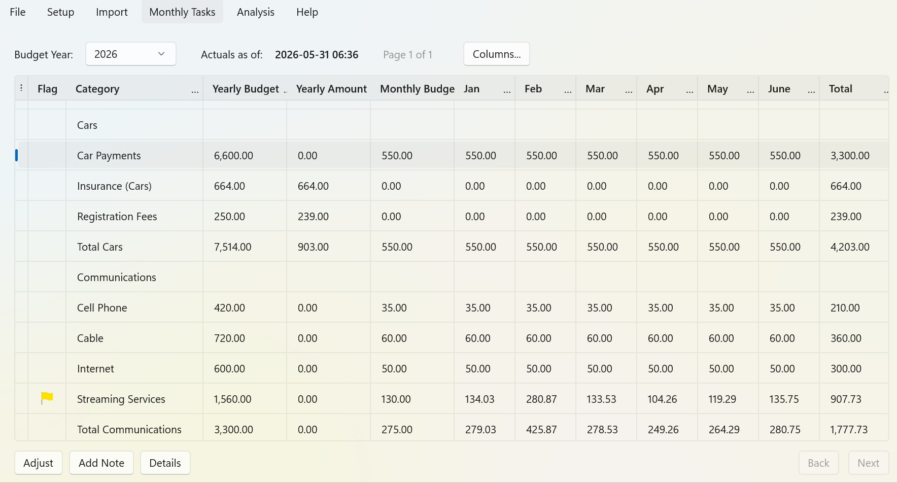

The main window is your primary budget view. Categories appear in the page and row order you defined, with budgeted, actual, and variance amounts shown by month and year. Use the **Columns** button to show or hide columns, and the **Details** button to drill into the transactions behind a row.

## Page Layout

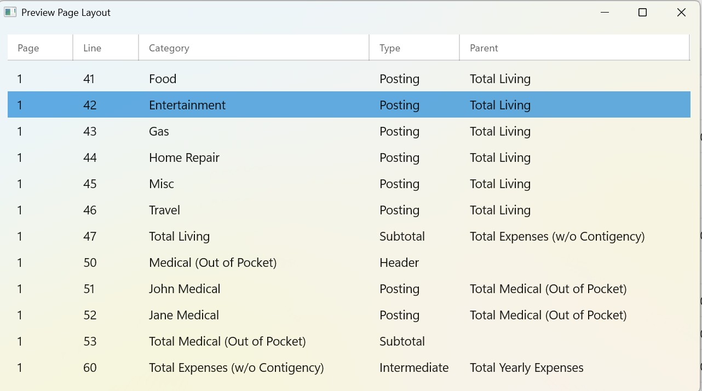

Buddy organizes categories across one or more pages. Headers group related categories, and sub-total rows summarize each group. Use **Back** and **Next** to move between pages when your budget spans multiple views.

## Account List

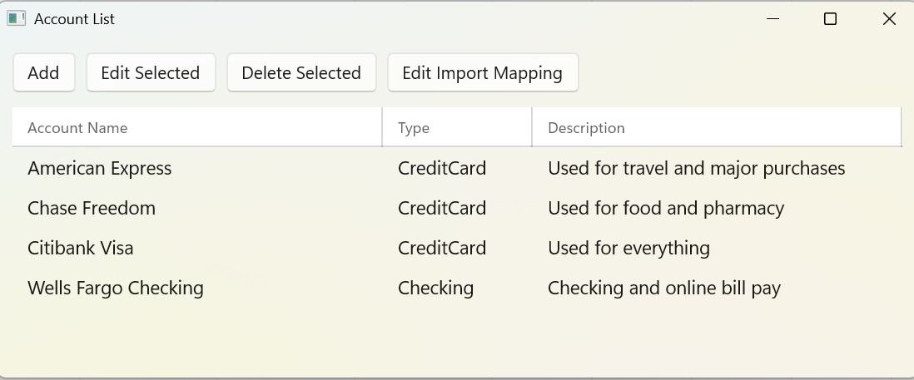

Define the bank and credit accounts you track in **Setup → Accounts**. For each account, you can set a default category and define the CSV import mapping used when you download transactions from that account's website.

## Category Hierarchy

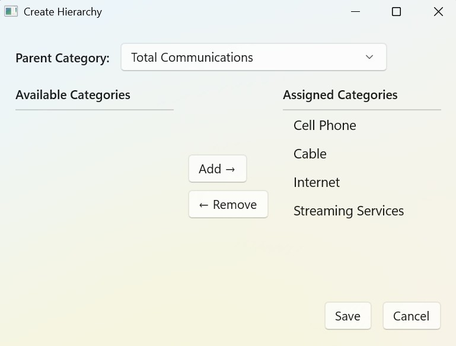

Buddy supports multiple levels of category roll-ups. Posting categories roll up into sub-totals, intermediate totals, and final totals—so you can see both detail and summary in one structure. For example, car payment, insurance, and registration can roll up to total car expenses, then to total living expenses.

## Reconcile Window

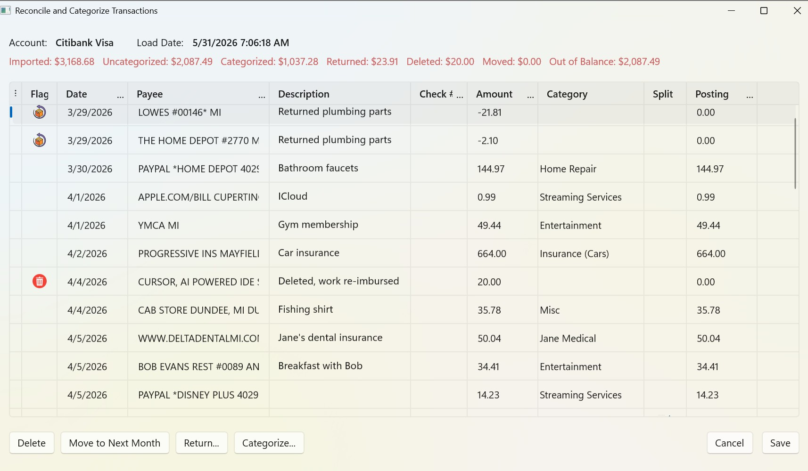

After importing a batch of transactions, use the reconcile window to review and balance them before posting. Control totals at the top show imported, categorized, returned, deleted, and moved amounts. They turn green when the batch balances to the penny.

## Assign Category

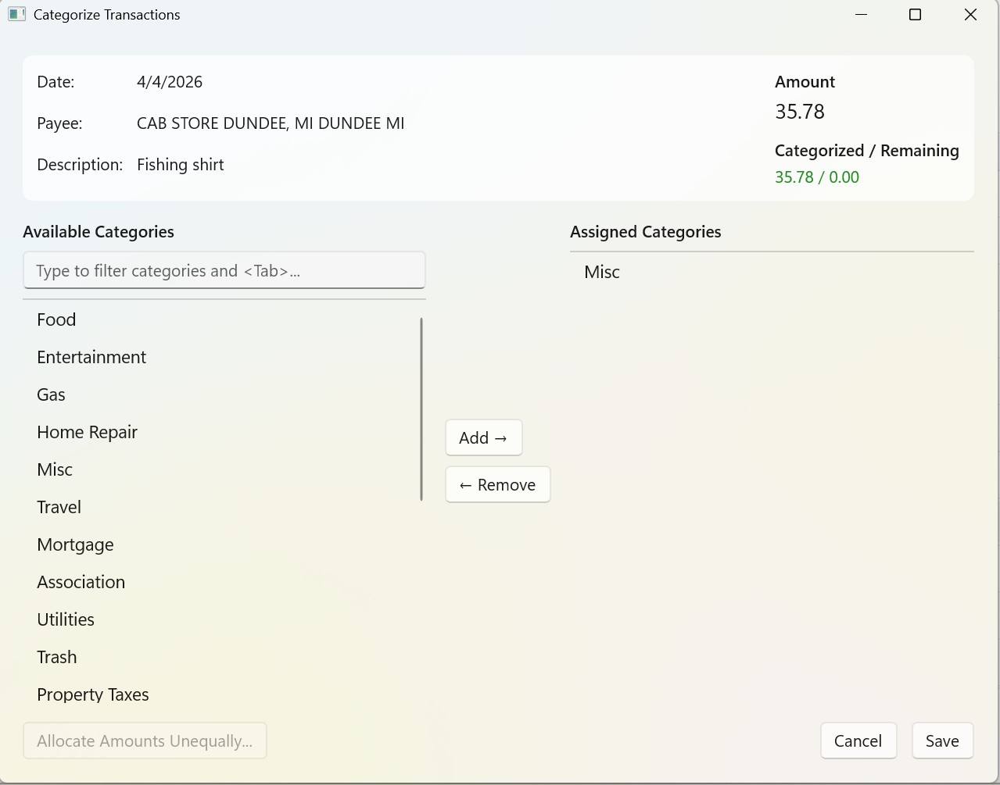

Assign each transaction to a posting-level category. Buddy suggests categories based on payee history and the account's default category. Available categories appear on the left; your assignment appears on the right.

## Assign Category (Split)

.jpg)

A single transaction can be split across multiple categories. Buddy starts by dividing the amount equally; use **Allocate Amounts Unequally** when you need specific amounts per category.

## Split Category Amounts

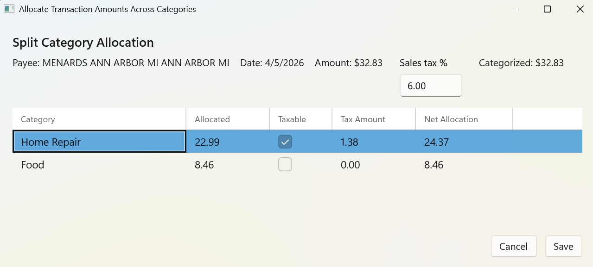

When items in one purchase are taxed differently—or simply cost different amounts—enter the allocation for each category. The **Taxable** option lets Buddy compute sales tax on the taxable portion so the transaction still balances.

## Actual versus Budget Dashboard

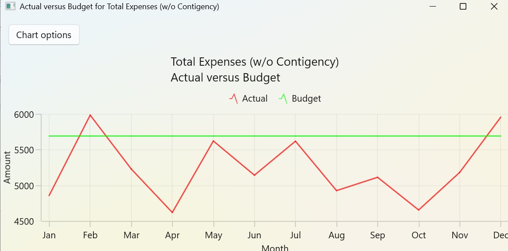

From **Analysis → Dashboards**, compare actual spending to your budget for any posting or summary category. View the results as a column or line chart for the year you select.

## Year versus Year Dashboard

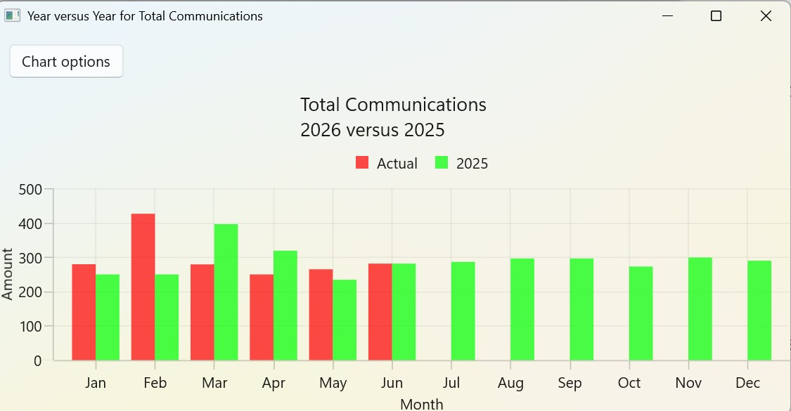

Compare a category's amounts across years to see how spending changes over time. Available as column or line charts, with an option to include categories budgeted on a yearly basis.

## Breakdown Dashboard

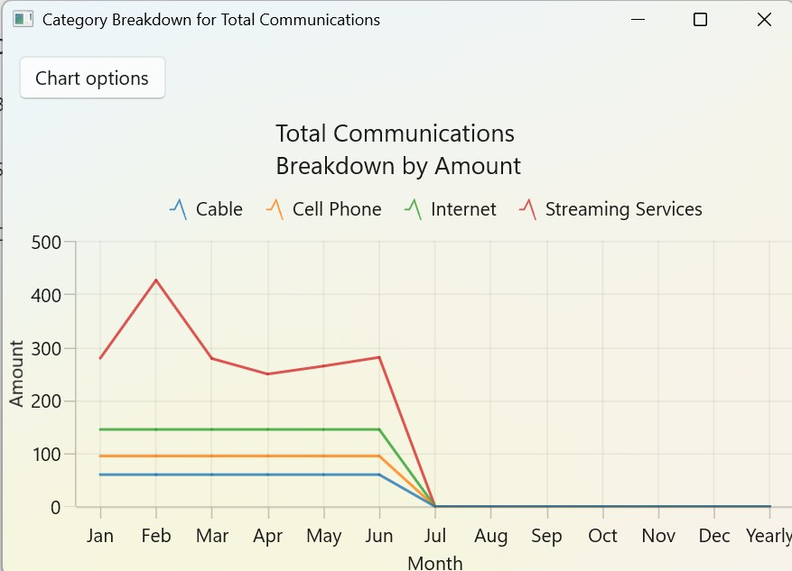

Pick a summary-level category and see how much each child category contributes—by amount or by percent. Stacked column and line chart views help you understand where spending within a group comes from.

## Uses SQLite

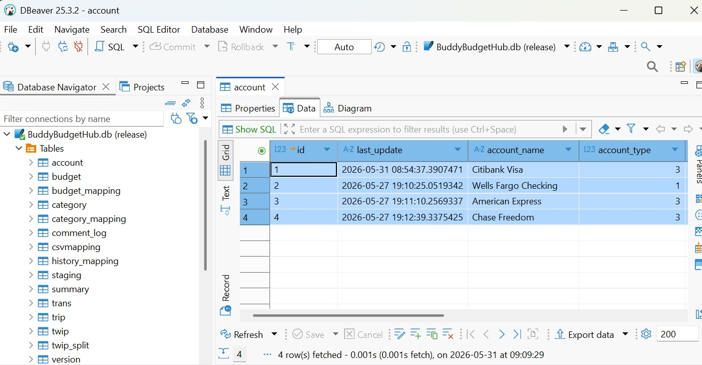

Buddy stores accounts, categories, budgets, and transactions in a local SQLite database. Your data stays on your PC and remains accessible outside the app for backup, custom analysis, or reporting.

