# Buddy the Budget Helper
## Sample Database
This folder contains sample files you can import to create a database for evaluating *Buddy the Budget Helper* and better understanding it's features.

**Note that *Buddy the Budget Helper* (Version 1.5.1) now includes this sample database and gives you the option to restore it upon first app start-up.  But using these sample files allows you to freshen the dates before you load them.** 

## Creating a Sample Database
1. **Initial Main Window** - The application starts with an empty database and the Main Window will look like this:

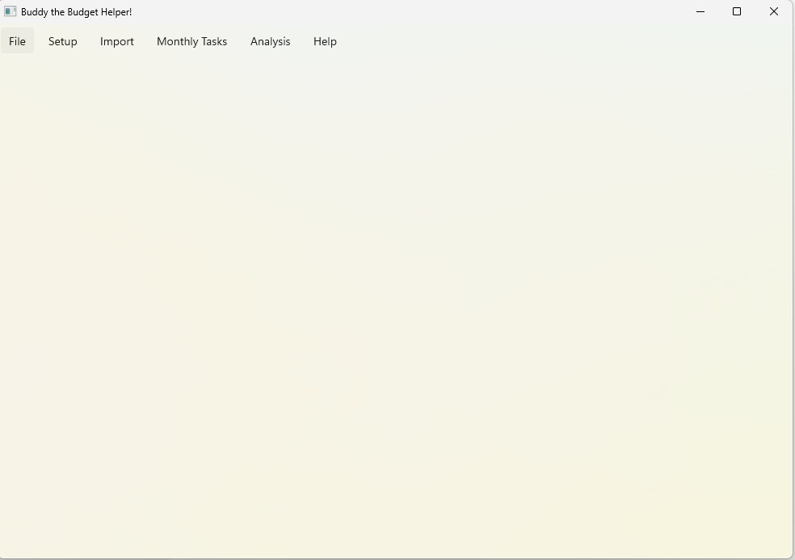

2. **Import Sample Categories** - Import the sample categories.  34 rows should be successfullly imported.

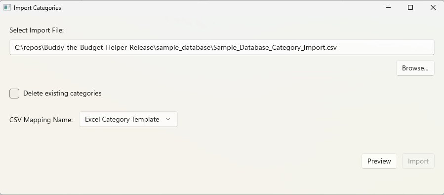

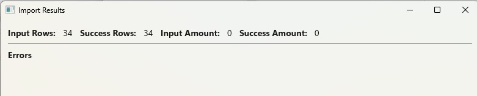

3. **Import Sample History** - Import the sample history data for 2025 and 2026 (through June).   56 rows should be successfullly imported.  Note this is summary data only, there is no transaction detail.

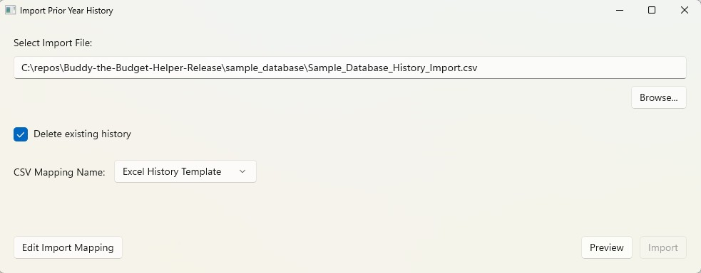

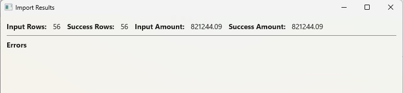

4. **Main Window Shows Data** - The main window will refresh and show the loaded data.

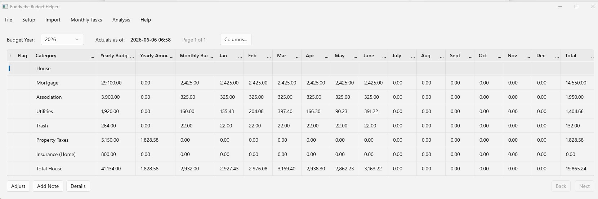

5. **Dashboards Show Data** - The dashboards now have data to display.

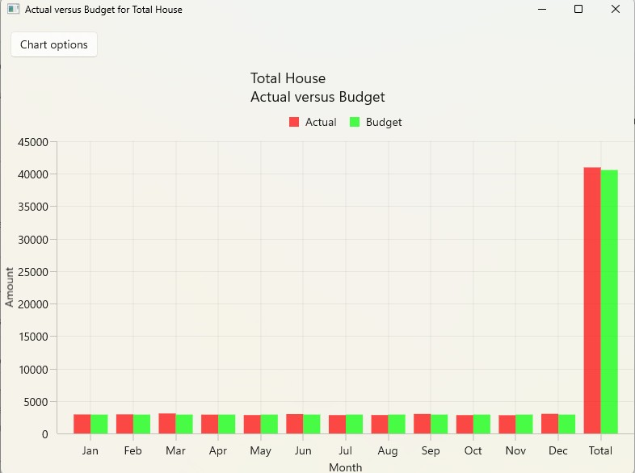

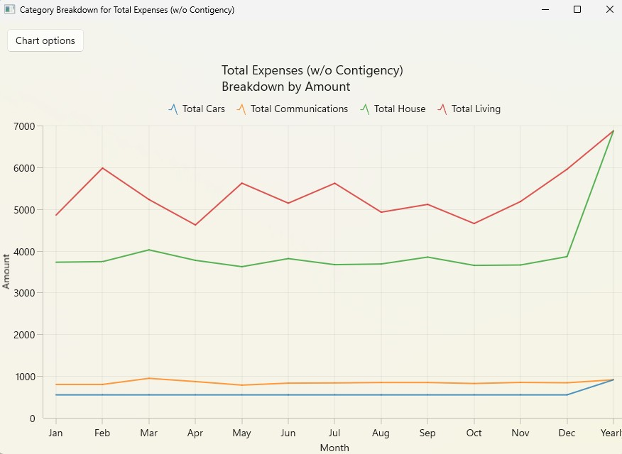

6. **Optional - Create Bank Account and Import Tranactions** - If you want to import transaction data and try the reconcilation process follow these steps:

    6a. **Create a Bank Account** - Create a bank account, the sample data is credit card transactions.  You can use any bank name. 

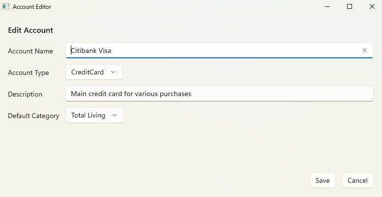

    6b. **Create the Import Mapping** - Define the import transaction mapping for this bank account.  
    The screen below shows the format of the sample transactions.

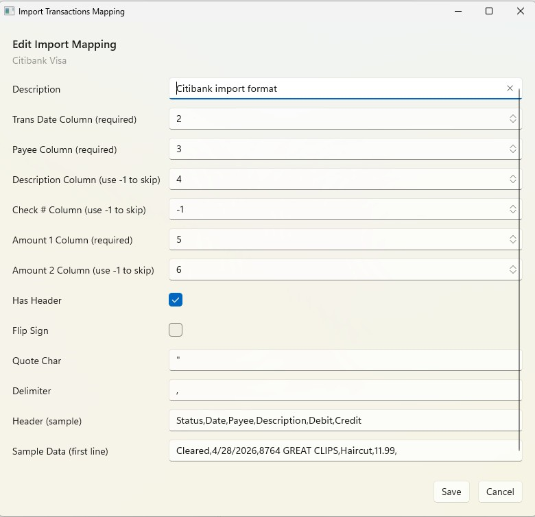

    6c. **Import the Transactions** - Import the sample transaction data for this bank account.  
    38 rows should be successfullly imported.      

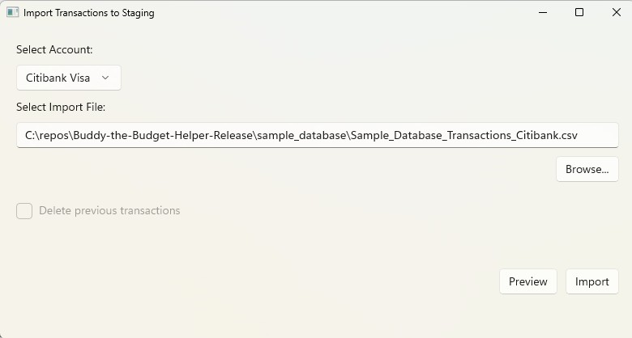

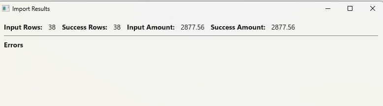

    6d. **Review and Categorize Transactions** - Select your bank account and your newly imported batch.  
    You will see the 38 transactions in the reconcile grid.  
    There are sample transactions for most of the scenarios (delete, return, split).     

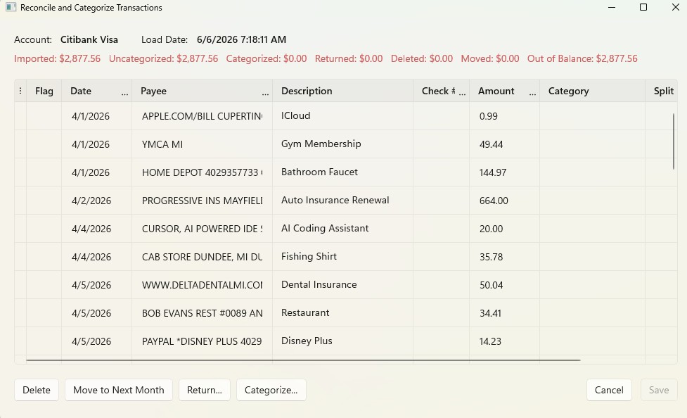

## Creating Your Own Database
 When you are ready to start with your own data, see the **Taking Care of Your Data** section of the **Help Contents** for instructions on creating a new database.  Or simply un-install and re-install Buddy the Budget Helper.
